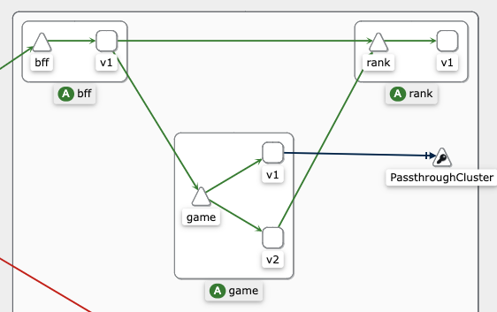
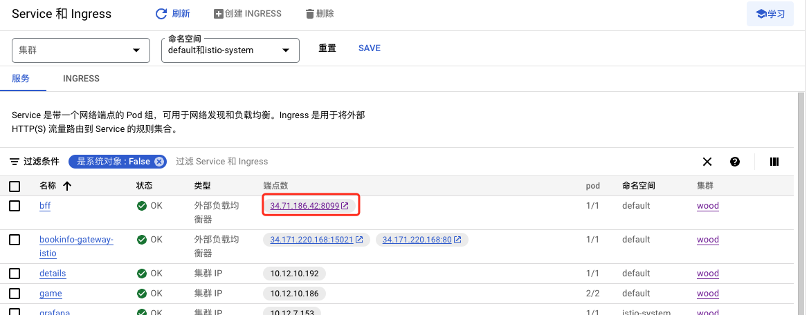
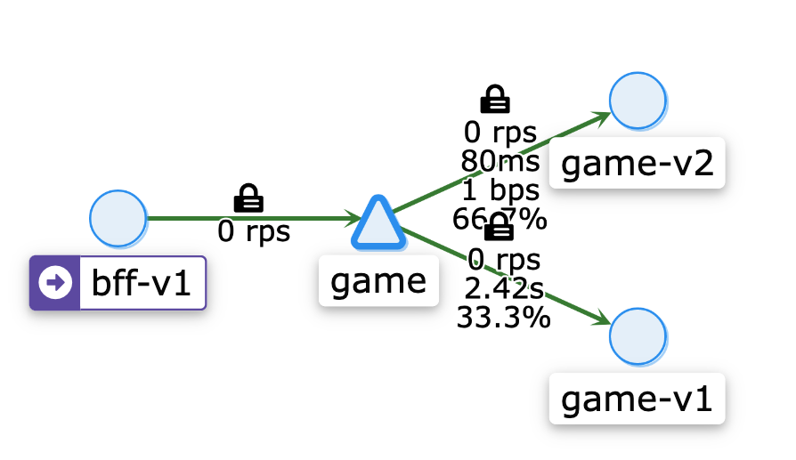
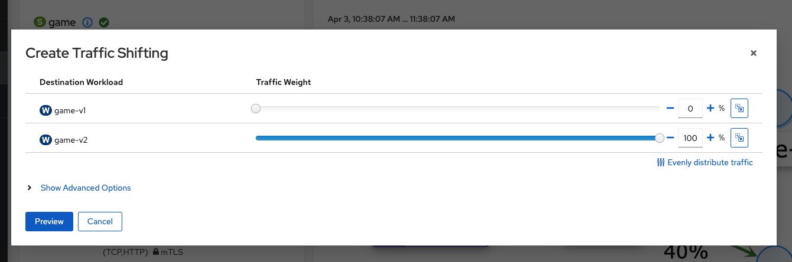
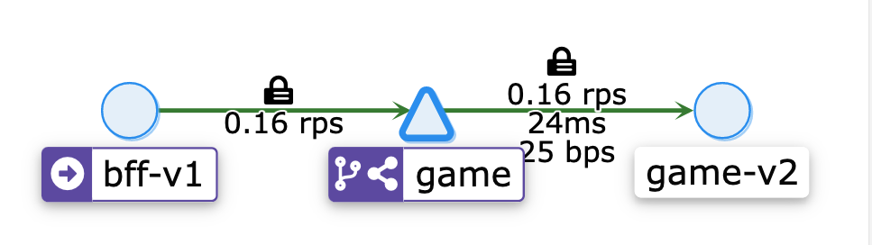
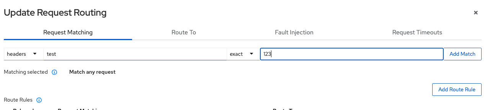
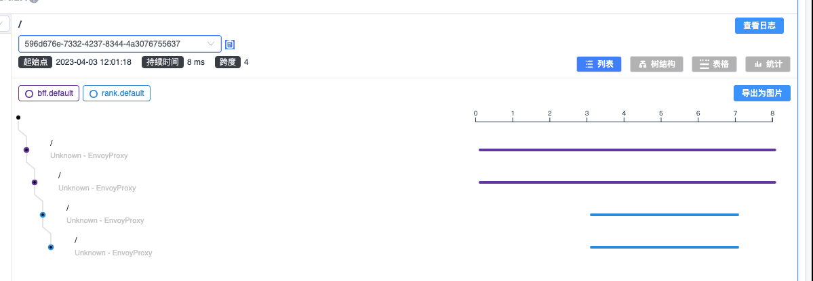

在全面拥抱kubernets的时代，本文探讨前端如何更好拥抱云原生，充分利用云原生的优势优化前端基础服务。以下是涉及到的技术点：

1. 基于云原生的前端微服务
2. 基于云原生的前端静态部署方案
3. 云原生下的前端流量治理：ab test，服务染色等
4. 纯前端架构下的全链路监控（基于istio和skywalking）

基于云原生的前端架构方案，能很好解决前后端流量管理，可观测性，可扩展性等问题。以前有实现前面这几个需求，可能需要一大堆自研配套基础组设施+一大推研发维护。现在在云原生方案加持下，这些问题都可以直接交给云原生，一杯咖啡的时间就能轻松实现。

## 基于nodejs的微服务部署

首先 ，我们先解决基于nodejs的前端微服务上云，架构图如下：



这个服务基于istio的[bookinfo](https://istio.io/latest/zh/docs/examples/bookinfo/)，为了让前端同学更好理解，这里做了小小的改造，用nodejs重写了一遍，方案是前端经典的BFF胶水层，把排行服务rank和游戏逻辑服务game的数据聚合，最后返回给web端。同时，为了方便让大家更好理解云原生的流量治理，game服务部署了v1、v2两个版本，可以做ab test或者小流量测试等。具体代码可以[参考](https://github.com/babyzone2004/wood/tree/master/apps/Server)。

接下来是解决部署问题，这里以google cloud为例，此处省略google cloud申请、开通集群步骤。

根据wood项目文档，先把服务打包镜像并上传到镜像仓库，然后部署istio（参考https://github.com/babyzone2004/wood）。

访问google cloud - service页面，就可以看到bff的公网访问地址了：



在执行shell命令：可以看到返回：`{"data":{"score":{"value":4}}}`。说明基于nodejs的微服务架构已经部署成功

```shell
curl 'http://34.71.186.42:8099/' \
  -H 'accept: */*' \
  -H 'content-type: application/json' \
  --data-raw $'{"operationName":"score","variables":{"userId":"123"},"query":"query score($userId: String\u0021) {\\n  score(userId: $userId) {\\n    value\\n  }\\n}\\n"}' \
```

在本地执行：`istioctl dashboard kiali`，可以启动kiali页面，进入sevices-game页面，可以看到请求经过game-v1,game-v2的流量情况：



在kiali页面，我们可以轻松做ab和流量染色，点击右上角Actions，选择Traffic Shifting，切换到Route To，把game-v2的流量改为100%。



再执行上面的shell命令，多请求几次。可以看到，流量都达到v2版本。



另外，在istio加持下，还可以轻松基于headers、uri、scheme、method、authority做流量染色，例如我们想对header匹配test:123的字段做全量，可以配置规则。这样就能轻松实现流量染色了。



## skywalking

istio官方示例使用了jaeger，要开启skywalking，需要单独配置一下，可以参考源码。配置成功后，命令行执行`istioctl dashboard skywalking` 就可以看到链路追踪日志了。



## 前端部署

传统的前端静态部署主要是服务器+nginx+cdn，得益于ngix的高性能和稳定，基本上也能覆盖大部分的使用场景。但传统的主机方式有个问题，在流量暴增的时候不能自动扩容。基于kubernets的动态伸缩，我们可以把服务部署到容器上。静态服务容器化有两个小问题：

1. **静态资源请求可能不一致：**由于html文件的请求和js等静态资源的请求是异步的，滚动更新的时候，会导致用户请求出错。例如在把4个v1pod更新到v2的过程中，用户可能请求到v2容器：index.html，解析index.html发起index.js请求，这个请求可能会落到v1容器上。
2. **pod资源利用率不高：**一个服务对应一组pod的方式，对于生命周期短的活动页面，有些浪费

第一个问题的解决方案是比较简单，js、css、image等静态资源单独部署到对象存储，通过cdn回源到对象存储，采用独立的域名即可。腾讯cos或者阿里oss都有成熟的方案。

第二个问题，可以考虑nginx服务容器化+文件存储的方式，nginx服务容器化顾名思义，即容器只有nginx服务，server的静态文件[NFS](https://kubernetes.io/docs/concepts/storage/volumes/#nfs) 的方式访问。无论是腾讯云的CFS还是google云的文件存储方案，都能做到毫秒级延迟。好处是既能利用kubernets的优势，又能保持前端 传统的部署方式，只要把release的html部署到文件存储上即可。而且日后要迁移到其他云服务也很方便。

云存储虽然能做到毫秒延迟，但毕竟比不上直接报错到本地硬盘，通过压测可以发现瓶颈在吞吐量上，为了极致优化性能，建议开启nginx的[open_file_cache](https://cloud.tencent.com/developer/article/1464131)，通过open_file_cache，ngxin可以直接访问缓存到内存上的内容，把频繁的网络IO降到10秒一次。坏处几乎没有，毕竟部署了代码等个10秒也不是事。

```nginx
open_file_cache max=1024 inactive=20s;
open_file_cache_valid 10s;
open_file_cache_min_uses 1;
open_file_cache_errors on;
```

经过以上改造，前端静态服务也拥抱云原生啦。对比原来的方式，有以下优点：

1. **降本增效：**通过kubernets的动态伸缩，可以在流量低的时候，使用减少的服务器资源，流量高的时候申请更多的服务器资源，极大降低了服务器使用成本。
2. **更健壮的服务：**流量高峰的时候能自动扩容，保证服务稳定
3. **流量治理：**通过接入isto，能做到更好的流量管理，包括路由配置、流量转移、熔断等
4. **可观察性：**更强大的网格可视化，链路追踪，性能监控等

由于篇幅有限，这里只记录了前端云原生探索过程中的一些关键点，对于具体代码实现，并没有展开阐述，有兴趣可以访问[github仓库](https://github.com/babyzone2004/wood)查看源码，上面记录了完整的部署方式和流程。

